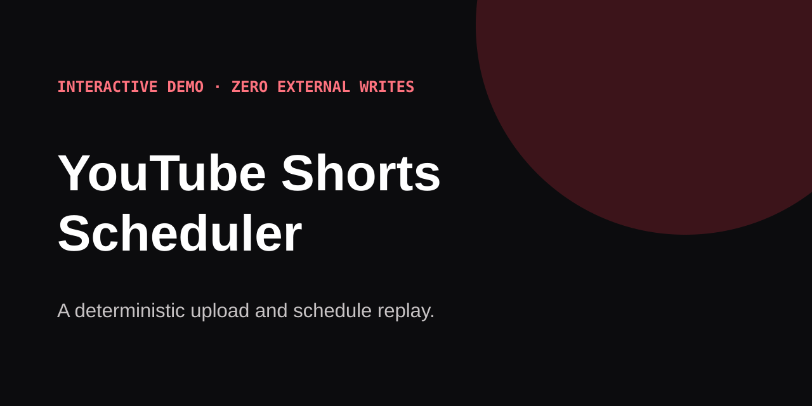

# YouTube Shorts Scheduler

Validate and rehearse an upload/scheduling batch offline, then use the same batch engine against YouTube Studio only when you deliberately choose live mode.



[Try the demo](https://caio-felice-cunha.github.io/youtube-shorts-scheduler/) · [Engineering case](https://caio-felice-cunha.github.io/youtube-shorts-scheduler/#architecture) · [View source](https://github.com/Caio-Felice-Cunha/youtube-shorts-scheduler) · [Run locally](#offline-demo)

**Interactive demo** · No login · No network call · No external write

## Offline demo

```bash
npm install
npm run demo
```

Open `site/index.html` through a static server. The versioned fixture is processed by a mock adapter and produces `site/demo-report.json`. Demo mode never imports Playwright, opens Chrome, contacts YouTube Studio, uploads media, or schedules content.

## Architecture

`batch-core.mjs` owns resumable sequencing. Live mode injects the CDP-backed upload adapter; demo mode injects a deterministic mock adapter. Tests guard this dependency boundary.

> **Live mode is explicit and potentially consequential.** Only `npm run batch` / `npm run upload` can attach to Chrome and write to YouTube. Review the manifest first and use only channels and media you control.

Upload and **schedule** videos to YouTube by driving **YouTube Studio** in your own
logged-in Chrome over the Chrome DevTools Protocol (CDP). No upload API, no OAuth
for posting, no OS file dialog — it attaches to a browser you control and clicks
through the real Studio wizard.

Works for any video (Shorts or regular). Give it a folder of video files plus a
small JSON manifest of titles / descriptions / publish times, and it uploads and
schedules them one by one.

> ⚠️ **Use responsibly, at your own risk.** This automates your own browser
> session. Automating YouTube may be against the YouTube Terms of Service —
> use it only on your own channel and content, and understand you are
> responsible for what you publish. Provided "as is" (MIT, no warranty).

---

## Why a browser, not the API?

The YouTube Data API can upload, but its quota makes bulk scheduling impractical
and it does not match every Studio feature. Driving Studio in a real, already
logged-in browser sidesteps quotas and posts exactly as if you did it by hand.

Two tricks make it reliable:

1. **Attach, don't launch.** Launching Chrome *via* automation sets
   `navigator.webdriver`, which Google detects and rejects. We attach
   (`connectOverCDP`) to a Chrome **you** launched, so the fingerprint stays clean
   and your login keeps working.
2. **Inject the file over CDP.** `DOM.setFileInputFiles` hands Chrome the local
   path directly — instant, no OS picker, no file-size cap.

---

## One-time setup

### 1. Install
```bash
npm install
```

### 2. Launch a debuggable Chrome

Chrome 136+ blocks `--remote-debugging-port` on your **default** profile, so use a
**separate** user-data directory. Close other Chrome windows first, then:

**Windows**
```powershell
& "C:\Program Files\Google\Chrome\Application\chrome.exe" `
  --remote-debugging-port=9222 `
  --user-data-dir="$env:USERPROFILE\chrome-automation" `
  --profile-directory="Default"
```

**macOS**
```bash
"/Applications/Google Chrome.app/Contents/MacOS/Google Chrome" \
  --remote-debugging-port=9222 \
  --user-data-dir="$HOME/chrome-automation" \
  --profile-directory="Default"
```

**Linux**
```bash
google-chrome \
  --remote-debugging-port=9222 \
  --user-data-dir="$HOME/chrome-automation" \
  --profile-directory="Default"
```

In that window, **sign into YouTube once**. The login persists in that
user-data directory, so you only do this the first time. (Pass `--profile-directory`
explicitly so Chrome opens a real profile instead of the profile picker — attaching
needs a concrete profile.)

### 3. Check the connection
```bash
npm run connect-check
```
Expect `signedOut: false`.

### 4. Configure
```bash
cp .env.example .env      # then edit .env
```
Set `VIDEOS_DIR` to where your video files live. Keep `DEBUG_PORT` matching the
port you launched Chrome with.

---

## Usage

### One video
```bash
# schedule
node src/upload.mjs --video ./videos/clip.mp4 \
  --title "My title" --description "My description" \
  --publish-at "2026-01-15 09:00"

# publish now
node src/upload.mjs --video ./videos/clip.mp4 --title "My title" --privacy public
```

### A batch (recommended)
```bash
cp manifest.example.json manifest.json   # then edit it
node src/batch.mjs
```

`manifest.json` is an array; each entry:

| field | required | meaning |
|---|---|---|
| `file` | yes | filename inside `VIDEOS_DIR` (or an absolute path) |
| `title` | yes | video title (trimmed to 100 chars) |
| `description` | no | description (newlines kept) |
| `publishAt` | no | `"YYYY-MM-DD HH:mm"` in your channel timezone → schedules. Omit to publish now. |
| `privacy` | no | `public` \| `private` \| `unlisted` (used only when there is no `publishAt`) |
| `madeForKids` | no | `true`/`false` (default `false`) |

The batch records finished uploads in `.posted.json` (gitignored), so if it stops
you can just re-run it and it skips what's done.

---

## Good to know (hard-won notes)

- **Times are in your channel's timezone** (Studio → Settings → set it once). The
  tool types the wall-clock time from your manifest as-is.
- **It verifies the schedule before committing.** It reads the date/time back from
  the dialog and aborts that video if they don't match what you asked for — so it
  won't publish at the wrong moment.
- **The wizard's Next/Schedule buttons use `aria-disabled`.** Clicking them while
  disabled (e.g. while the upload is still processing) silently saves a private
  draft. The tool waits for them to truly enable, which is why each upload takes a
  bit.
- **Optional but smart: verify with the API.** A green wizard is not proof.
  If you want certainty, check each video's real status (`publishAt` set vs. a
  stray draft) with the YouTube Data API using **your own** OAuth credentials.
  That step is intentionally not bundled here so the tool needs no secrets.
- **Selectors can change.** This drives Studio's DOM; if YouTube changes the UI,
  a selector may need updating. PRs welcome.

---

## License

MIT — see [LICENSE](LICENSE).
